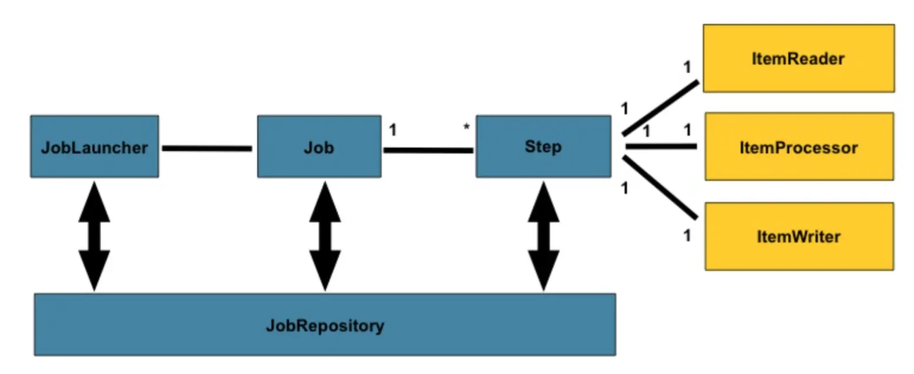

1. spring-batch + schedule
  
2. Before you start up application: 
    
    please modify your own database config : application.yml 

    please prepare the metadata table for spring batch : metadata/batch_innodb.sql
    
    please prepare access table for this demo test : metadata/access.sql
    
